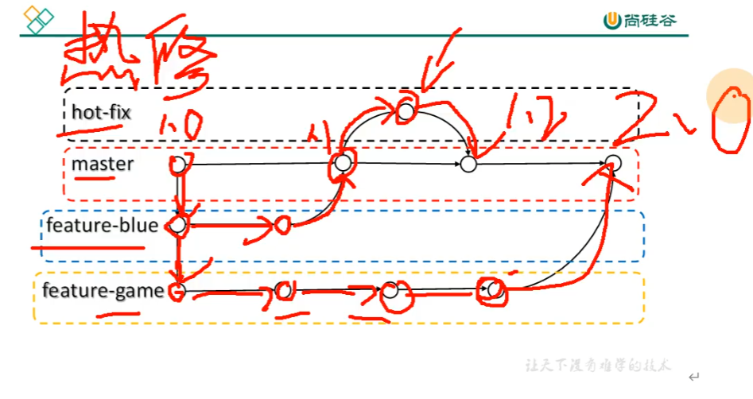
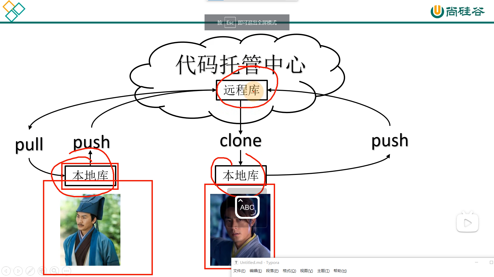
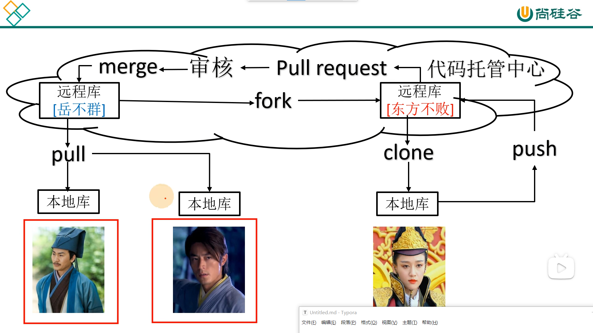

### git介绍

- 分布式版本控制工具

​	`git版本控制工具，每个人在自己的电脑里面有一个完整的版本库，即使远程库宕机，也可以进行开发，主要用于企业的开发.`

- 集中式版本控制工具

  `svn版本控制工具，所有的版本控制在一个集中的服务器中，如果服务器宕机，则项目无法进行版本控制`

linus（人）开发

* git的工作逻辑

  `工作区，暂存区，和本地库 和远程仓库`

* 代码托管中心  

  `国内的就是gitee，国外的github 以及局域网的gitlab`

### git 安装

`改路径，按默认 基本就可以`

### git命令

- 设置用户签名

  `git config --global user.name ty`

  `git config --glabal user.email 19704769@qq.com`

- 初始化本地库 init

  `git init`

  `查看隐藏内容 ll -a`

- 查看本地库状态

  `git status`

  `查看cat 和 tail -n 1查看的最后一行`

  `vim hello.txt 创建文件`

- 添加暂存区

  `git add 加文件名字 添加`

  `git rm --cached 文件名字  删除暂存区的文件`

- 提交本地库

  `git commit -m "提交信息" hello.txt`

  `git relog 查看版本引用日志信息`

- 修改文件

  `使用vim 更改文件内容，add 提交，status 查看版本状态`

  `commit 提交到本地库 relog 查看指针的指向，以及版本信息`

  `cat查看文件内容`

- 查看历史版本

  `使用reflog 查看版本号 然后 git reset --hard 版本号 回到之前的版本`

  `.git 文件中的head保存的是分支内容，ref中的master保存的是现在查看的版本号`

### git分支

- 分支的概述

  

- 分支的操作

  `查看分支 git branch -v`

  `创建分支 git branch 分支名字`

  `切换分支 git checkout 分支名字   切换后 head master都会改变   `

  `建议，提交的时候 备注信息 要体现分支的名字`

- 合并分支

  ` 切换到要合并后的分支 git merge 合并的分支  `

  `分支冲突是：主分支有分分支没有的内容，想保留的内容留下来，需要手动删除多余的内容（保证代码还是原来的行数）`

  `需要人为决定使用哪一个：同样先进行合并，报错后，查看status`

  `手动打开报错的文件：vim 文件名字；删掉多余的内容，再删掉提示性的文字`

  `最后提交到暂存区 提交到本地库的时候不能再带文件名字了`

  

  注意（只改变主分支的内容） 

  ​		各个分支只是只想具体版本内容的指针

  ​		head 决定指向哪一个分支

### 团队协作

### idea继承git

------

## github

### 创建远程库

- 团队协作

  内

  

  外

  

- 创建远程库 和 创建别名

  创建远程库使用`github `右上角的加号（尽量和自己的本地库名字一样）

  创建别名再 git 中 `git remote add [别名] 远程地址`

  使用`git remote -v `查看现在的所有别名

### 推送

- 推送

  `git push 别名 分支名`

### 拉取

​	`git pull 别名 分支名`

​	直接拉取到本地库 

### 克隆

​	无需登录权限

 	克隆实际上做了三件事 1. 拉取代码 2、初始化本地库 3、创建别名（默认是origin）

- 团队内协作的过程

  需要让库的主人设置邀请团队成员 才能让别的成员将克隆的内容 修改后 push内容到库

### ssh免密登录

------

## gitee

### 创建创建远程库

### idea集成

------

## gitLab

### gitLab服务器搭建部署

### idea集成