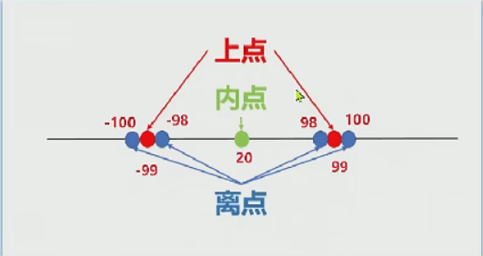

## 等价类划分法

- 概念：找到共性，避免穷举（减少测试数量，提高效率）

- 分类

  - 有效等价类
  - 无效等价类

- 设计测试用例的步骤

  - 划分等价类
    1. 有效
    2. 无效
       1. 规则（需求本身）
       2. 长度
       3. 类型
       4. 是否为空（必填项）
       5. 是否重复
  - 设计测试用例

- 典型应用场景

  - 输入框

- 案例

  - 案例一

    

| 需求分析 |            |      |
| -------- | ---------- | ---- |
|          | 6-10自然数 |      |

划分等价类

| 6-10自然数 | 有效等价类   | 有效数据 | 无效等价类    | 无效数据    |
| ---------- | ------------ | -------- | ------------- | ----------- |
|            | 6-10位自然数 | 123456   | 长度小于6位   | 12345       |
|            |              |          | 长度大于10位  | 12345678910 |
|            |              |          | 非自然数_字母 | abcdef      |
|            |              |          | 非自然数_字符 | !@#$%^      |
|            |              |          | 非自然数_汉字 | **汉字**    |
|            |              |          | 不输入        |             |

设计用例

| id     | 模块 | 优先级 | 标题                          | 前置条件 | 测试数据 | 执行步骤                 | 预期结果 |
| ------ | ---- | ------ | ----------------------------- | -------- | -------- | ------------------------ | -------- |
| QQ_001 | QQ   | p1     | 输入6-10位自然数，QQ号正确    | /        | 123456   | 1.打开QQ 2.输入QQ号 | QQ号正确 |
| QQ_001 | QQ   | P2     | 输入小于6位的自然数，QQ号错误 | /        | 123      | 1.打开QQ 2.输入QQ号 | QQ号错误 |
|        |      |        |                               |          |          |                          |          |
| QQ_001 | QQ | p2 | 输入6-10位的字母，QQ号错误 | / | adfghj | 1.打开QQ 2.输入QQ号 | QQ号错误 |
|        |      |        |                               |          |          |                          |          |
|        |      |        |                               |          |          |                          |          |
|        |      |        |                               |          |          |                          |          |

> 当有多个输入条件，务必确保只有不满足输入条件，这样才能确定出现问题的输入条件。1

多个输入条件时候，标题取名

|      |      |      | 标题                                                     |      |      |      |      |
| ---- | ---- | ---- | -------------------------------------------------------- | ---- | ---- | ---- | ---- |
|      |      |      | 邮箱正确（正确条件），密码正确（密码正确条件），登录成功 |      |      |      |      |
|      |      |      | 邮箱错误（错误输入方式），密码正确，登陆失败             |      |      |      |      |

## 边界值分析法

- 作用：对等价类的补充，统计表明程序做容易出错的地方就是在边界附近

- 概念：基于边界值【有效等价类，和无效等价类的分界点】设计测试用例的一种【黑盒】方法

- 边界值

  - 上点：边界点

  - 内点：边界之内的点

  - 离点：距离边界最近的左右两点

    

- 设计测试用例步骤

- 
